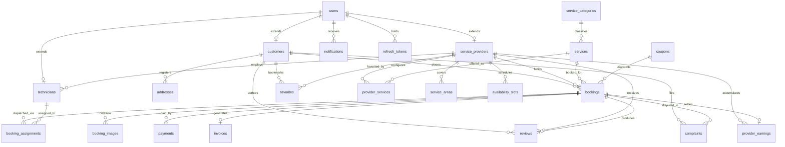

# HomeServe Technologies – Entity Relationship Diagram

```mermaid
erDiagram
    users ||--o| customers : "extends"
    users ||--o| service_providers : "extends"
    users ||--o| technicians : "extends"
    users ||--o{ notifications : "receives"
    users ||--o{ refresh_tokens : "holds"

    customers ||--o{ addresses : "registers"
    customers ||--o{ bookings : "places"
    customers ||--o{ reviews : "authors"
    customers ||--o{ complaints : "files"
    customers ||--o{ favorites : "bookmarks"

    service_providers ||--o{ technicians : "employs"
    service_providers ||--o{ provider_services : "configures"
    service_providers ||--o{ service_areas : "covers"
    service_providers ||--o{ availability_slots : "schedules"
    service_providers ||--o{ bookings : "fulfills"
    service_providers ||--o{ reviews : "receives"
    service_providers ||--o{ provider_earnings : "accumulates"
    service_providers ||--o{ favorites : "favorited_by"

    service_categories ||--o{ services : "classifies"
    services ||--o{ provider_services : "offered_as"
    services ||--o{ bookings : "booked_for"

    bookings ||--o{ booking_assignments : "dispatched_via"
    bookings ||--o{ booking_images : "contains"
    bookings ||--o{ payments : "paid_by"
    bookings ||--o| invoices : "generates"
    bookings ||--o| reviews : "produces"
    bookings ||--o{ complaints : "disputed_in"
    bookings ||--o| provider_earnings : "settles"

    technicians ||--o{ booking_assignments : "assigned_to"

    coupons ||--o{ bookings : "discounts"
```
